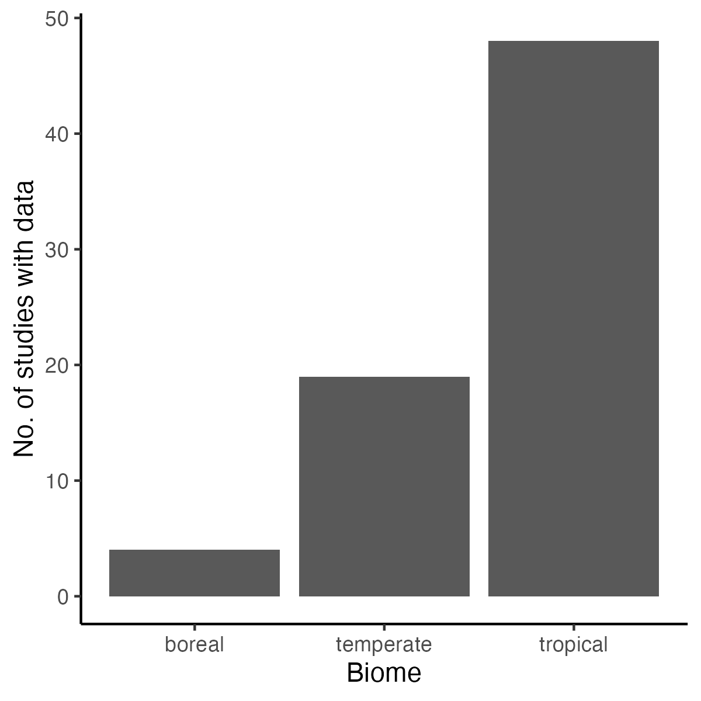

```{r setup, include=FALSE}
knitr::opts_chunk$set(
	echo = FALSE,
	fig.path = "figures/",
	dev = "png",
	dpi = 300,
	message = FALSE,
	warning = FALSE,
	collapse = TRUE,
	comment = "#>"
)
options(knitr.duplicate.label = 'allow')
options(knitr.graphics.error = FALSE)  # This allows for the include_graphics to not use the path from root 
knitr::opts_chunk$set(echo = TRUE, fig.align="center")
knitr::opts_chunk$set(fig.pos = "H", out.extra = "")
knitr::opts_chunk$set(tab.pos = "H", out.extra = "")
# library(grateful)
library(tidyverse)
library(kableExtra)
library(here)
library(knitr)
# library(vartest)
# library(purrr)
# library(broom)
# library(grid)
# library(gridExtra)
# library(png)
# library(egg)
# library(magick)
# library(citr)
# library(devtools)
# devtools::install_github("crsh/papaja")


knitr::opts_chunk$set(echo = FALSE,message=FALSE,warning=FALSE)

```

# Introduction 

Since habitat fragmentation was first identified as a threat to the integrity of ecosystems [@harrisFragmentedForestIsland1984; @wilcoveHabitatFragmentationTemperate1986], the ongoing transformation of landscapes has kept it in the theoretical and empirical spotlight [@brudvigEvaluatingConceptualModels2017; @resascoContributionTheoryExperiments2017]. The dynamics of populations, communities, and ecosystem processes are often dramatically altered in habitat fragments [@fischerLandscapeModificationHabitat2007; @harrisonHabitatFragmentationLargescale1999; @lauranceFateAmazonianForest2011; @zartmanHabitatFragmentationImpacts2003]. These ecological changes observed in fragments – especially forest fragments – are often attributed to changes in abiotic factors such as temperature and relative humidity following fragment isolation [e.g., @mesquitaEffectSurroundingVegetation1999[@brunaExperimentalAssessmentHeliconia2002; @brunaSeedGerminationRainforest1999]. 

That abiotic conditions are severely altered in fragments is one of the most important paradigms to have emerged from the study of fragmented landscapes. Because changes in abiotic conditions are thought to be most severe at the fragment/matrix boundary and then dissipate towards the fragment interior they are frequently referred to as “edge effects” [@broadbentForestFragmentationEdge2008]. The magnitude of these edge effects is also thought to depend on a number of landscape attributes, including the size and orientation of the fragment, how long ago it was isolated, and the type, structure, and history of matrix. These generalizations, coupled with the presumed ubiquity of edge effects and their impacts, has led to the Edge Effects Paradigm playing a central role in the study of fragmented landscapes and strategies for their conservation. 

In 1995 Carolina Murcia wrote the first review of empirical studies testing for edge effects in fragments (Murcia cite). She found that that the limited number of studies, their poor or limited design, and inconsistent methods made it impossible to draw general conclusions. “Although estimates of the intensity and impacts of edge effects in fragmented forests are urgently required”, she concluded, “little can be done to ameliorate edge effects unless their mechanics are better understood”. Her review ended with a call for researchers to conduct more comprehensive and long-term studies, emphasizing the importance of study design and methods that were relevant beyond a single study site and allowed for broader synthesis. 

Here we assess the how the studies and evidence underlying the edge effects paradigm have changed in the 25 years since the publication of Murcia’s review. To do so, we identified studies measuring abiotic conditions in fragmented landscapes and used the data they report to address the following three questions:  
\bigskip  

1.	Are there edge-dependent changes in abiotic conditions? If so, what is the functional form of these changes (i.e., linear vs. non-linear)?  

2.	How far from forest edges into forest interiors can one detect significant changes in abiotic variables?  

3.	How are changes in abiotic conditions influenced by fragment and landscape attributes such as size, edge orientation, latitude, and matrix type? 
\bigskip  

We show that the paradigm of abiotic changes in habitat fragments continuous to be built on a weak empirical foundation: a small number of short-term and spatially restricted studies whose results are often inconclusive, incomparable, and inconsistent. 

# METHODS 

## Literature review

Our review is based on studies of fragmented landscapes that included data on any of the following seven abiotic variables – air temperature (AT), relative humidity (RH), vapor pressure deficit (VPD), soil temperature (ST), soil moisture (SM), photosynthetically active radiation (PAR), or wind speed (WS); we chose these variables because preliminary surveys indicated they were the only ones reported in >10 studies (Table 1). Because we were interested in edge-interior comparisons, studies had to report data on at least one of these variables from at least one location on the forest or fragment edge and at least one location in the forest of fragment interior. We excluded studies reporting data from plantations, as it is unclear the extent to which these habitats are environmentally similar to primary forest [@denyerBufferingNativeForest2006]; the one exception was a study in which the forest remnants were abandoned plantations of native tree species [@dilrukshiKirigalaForestFragments2016].  

We searched for potentially relevant studies by conducting a search of the Web of Science Core Collection in March 2017 using the following search string: 
\bigskip  

>>("forest fragment*" or forest "edge eff*") AND ("soil (temperatur* or moisture)" or "light intensit*" or "(air or ambient) temperatur*" or humidity or "wind speed" or precip*).  

\bigskip  

This search returned an initial list of 205 publications, to which we added any potentially relevant studies after reviewing all book chapters and papers cited by these publications or any that cited them following their publication. A total of N=71 studies reported collecting data in a manner that met our criteria. 

## Data collection 

We collected the following data on each of N=71 studies included in our review: (1) the location and biome and in which the study was conducted, (2) the abiotic variables measured, and (3) the equipment used to collect the data. We also collected data on the sampling design. (4) the number and spatial arrangement of locations where the data were collected, (5) the duration of data collection, (6) the frequency of data collection, and (7) the distance from the edges to the site that investigators considered the forest interior (Table --, Figure --). Sampling layouts consisted of the spatial arrangement of sampling points per replicate edge or fragment and were categorized whether points were in transects perpendicular to the edge, in those parallel to the edge, in multiple transects of either type, only in specific and fixed areas (e.g. ‘edge’ and ‘interior’), or randomized. True replicates were those which are separated enough in space to constitute independence at the level the authors studied – for instance, samples on the same fragment count as a single replicate when authors are testing hypotheses about fragments generally.]

From each study we then extracted the mean and variance of the abiotic measurements at every point where they were collected. In some cases, these values were reported in the text or tables [e.g., @heitheckerEdgerelatedGradientsMicroclimate2007]. When these data were presented in figures, we estimated the values using the WebPlotDigitizer software package (Copyright 2010-2017 Ankit Rohatgi). When results were reported as the percent change from a specific edge or interior location [e.g., @pohlmanEdgeEffectsLinear2007], we used the values reported for that reference location to calculate the mean and variance for the other ones.  Finally, we standardized the results across studies by calculating the percent difference between each point in a study and the reference location identified by authors as the forest or fragment interior. Because there was little consistency in how environmental data were reported, this was the only way to compare and synthesize results from different studies.

## Analyses

**_Are there edge-dependent changes in abiotic conditions? If so, what is the functional form of these changes (i.e., linear vs. non-linear)?_** To identify the functional form that best describes the way in which abiotic conditions change with increasing distance from edges to interiors, we fit the data for the percent difference from the interior at different distances from the edge with a linear model (LM), a generalized linear model (GLM), and a LOESS curve. We then compared these models to determine whether a linear regression could explain the relationship between abiotic variables and distance as effectively as the LOESS curve, which indicates excellent fit to the data. For these models, distance from the edge as well as the abiotic response variables were log-transformed to linearize the explanatory variable and allow a regression to be run.

**_How far from forest edges into forest interiors can one detect significant changes in abiotic variables?_** To find the distance at which edge effects are no longer significant (i.e. the interior), we noted where the 95% confidence interval of the mean standard error crossed the linear regression from question 2. This method is based on Laurance et al’s (1998) modelling of edge effects on tree mortality; we used standard error to construct confidence intervals because it was the most common measure of variance and did not require detailed data about each individual study’s analyses.

**_How are changes in abiotic conditions influenced by fragment and landscape attributes such as size, edge orientation, latitude, and matrix type?_** To determine relationships between an abiotic measurement and contextual information about the study landscape we used linear mixed models (LMMs). Although not all data were normally distributed, we used LMMs instead of generalized linear mixed models (GLMMs, Bolker et al. 2009) because alternative link functions were often inappropriate for our analyses (e.g., our proportional response variables were not bounded by 0 and 1). All abiotic measures were natural log transformed before analysis.

Models for this analysis used the percent difference from the value for “interior” as the dependent variable. The main effects were distance from the edge at which a measurement was recorded, the orientation of the edge at which measurements were taken, the edge age in years, and the type of matrix type abutting the edge (grass, agricultural field, savanna, plantation, shrubland, forest, sandscrub, young forest, clearcut, highway, or powerline). Article identity and transect identity were treated as a nested random effect, based on the recommendations of Harrison et al. (2018).  We began by fitting a model that that included only the random effect of article, then one that also included distance from the edge. We then created increasingly complex models with the other dependent variables; to avoid overfitting, we restricted the models to three explanatory variables total as main effects, including interactions of distance and another measure (Table 5). We then used a corrected Akaike Information Criteria (AICc, Burnham and Anderson 2004) to rank the models and identify the one that provided the best fit to the data with the fewest parameters as the one with the lowest significant AICc value. Although LMMs conducted in R do not indicate significance values, to establish which variables are likely contributing most to the effect seen, we obtained significances from the model’s generalized linear equivalent, which does provide them.  

To compare variance differences between edge and interior sites, we recorded variances (including confidence intervals, standard error, etc.) reported in studies separately from their associated data points and fit them with a LOESS curve (Figure 5). All analyses were conducted using the R statistical programming language (R Core Development Team 2014) and the lme4 library (Bates et al. 2015).

# RESULTS

Most studies were conducted in Brazil, the United States, and Australia (Figure 2). Biome type?

Air temperature (AT) and relative humidity (RH) were the abiotic measures most often recorded, with n = 65 and n = 53 respectively (Table 2), and these two variables were recorded together in X out of Y studies (Table 3). Need some info on the other variables.

Sampling duration was highly variable (range: X-X), with a modal value of XX= days and a median = XX days. Nearly 20% of the N=71 studies collected data for less than 30 days, and 10% of studies collected data for 10 days or less (Fig. 9). Three studies collected data for >700 days. 

Most studies also collected data in few locations: 31% of the studies we reviewed (N=22) only collected data in a single fragment or forest site. An additional N=23 studies used 2-3 replicates. Data were typically collected along a singular transects perpendicular to the edge (41%, N = 29), with only N= 8 (11%) randomly arranging data collection points (Fig. 10). Electronic data loggers were the most common form of data collection (N=XX), followed by thermohygrometers.

Of the 71 studies testing for edge effects, we were only able to extract data for analyses from half (n = 35).

**_Are there edge-dependent changes in environmental conditions, and if so, what factors influence them?_** The models for all abiotic variables were best fit by distance from the edge. Soil moisture (SM) showed additional significant influence from the matrix type and the interaction of distance and matrix type (Table 4). Edges near agricultural fields and clearcuts showed the lowest soil moisture, while edges created to fit powerlines in general had higher soil moisture than the forest's interior (Fig. 3).
Additional testing with GLMs which showed a medium to strong effect of latitude for changes in AT, RH, and VPD (Table 6), indicating an effect of geographic location on edge impact. Changes in AT and VPD were highest at 40 degrees south, and most stable at 40 degrees north. Relative humidity at 20 degrees south experienced more change than at 40 degrees north.

Contrary to our expectations, some of the abiotic measures were not much more variable at edges than at interiors. The spreads of points of RH, PAR, and WS are not much wider when at the edge (x = 0) than at 50 meters, by which distance all these measurements had reached roughly interior conditions based on LOESS smoothing (Fig. 4). Soil measurements, AT, and VPD, however, were much more variable at the edge. The variances taken from the original studies showed an obvious relationship to distance from the edge in PAR and WS. (Fig. 5)

**_What is the functional form of abiotic changes at edges?_**  The use of LOESS curves overall showed a steep decline in percent change from each point’s associated interior measurement, indicating that edges in our data were much different from interiors. These changes ranged from a low of around 10% difference at the edge from the interior, as in the cases of RH and SM, to a high of over 1500% change in PAR (Fig. 4). AT, VPD, ST, PAR, and WS all increased as measurements approached the edge, while RH decreased. SM did not show an obvious trend.

AT, RH, VPD, ST, PAR, and WS all show a consistent pattern like logarithmic curves rather than simple linear declines, with steep changes quickly leveling off near y = 0 which demarcated fragment or forest interior conditions. The exception to this pattern was exhibited only by SM, which reached interior conditions within 50 meters, became more divergent from the interior between 25-100 meters, then again steadily became more like the interior. This deviation is partially due to the high influence of article 29, which provided many points of reference; however, even the removal of this study from the graph leaves a similar undulating curve. 

**_How far into forests can significant abiotic changes be observed?_** Following the LOESS trend lines, edge effects did not obviously occur past 100 meters globally for any variable except SM. When we took the natural log of both distance from the edge and abiotic measures to linearize these measures, the LOESS curve did not significantly deviate from a linear regression (Fig. 6). 

Based on the intersection of the regression and the 95% confidence intervals of interior conditions, air temperature, relative humidity, soil temperature, and soil moisture do not show significant edge effects globally. Vapor pressure deficit showed significant edge effects until 25 meters, while photosynthetically active radiation intersected between 0 and 3 meters, and wind speed intersected between 3 and 7 meters (Fig. 7). 

A more conservative approach to edge effects, however, requires finding the point where the regression explicitly meets interior conditions; with our dataset, interior conditions are found at the x-axis. The mean of the x-intercepts for regression lines, excluding soil moisture (SM) as an extreme outlier, set the edge-interior boundary at 84 meters for all abiotic measures. PAR showed the shortest edge in regression with interior conditions at 34 meters, and the miniscule slope of the SM regression put its ‘interior’ point at over 2 million meters. WS, the abiotic measure for which we had the least data, had the most variability in estimates for a linear regression. These estimates placed the interior for WS anywhere from roughly 20 meters to 90 meters, where the actual regression placed the interior at 42 meters. Overall, what counts as an interior depends on which abiotic measures are of interest, but all variables except soil moisture stabilize within 100 meters based on simple regression.

The tropics showed abiotic edge effects disappearing by 100 meters, while temperate areas settled into interior conditions by 75 meters based on a LOESS fit, both excepting SM (Fig. 8). A lack of data from boreal regions restricts any generalizations about edge penetration in this biome.

# DISCUSSION

Half of the world’s forest area is within 500 meters of an edge (Haddad et al. 2015); with sprawling development and agricultural interests, the situation is likely to get much worse. Abundances of 85% of all vertebrate species worldwide are influenced by edges, and species which thrive in interior conditions are more likely to be imperiled (Pfeifer et al. 2017). Although our compiled data does not show that edge effects exist globally for air temperature, relative humidity, soil temperature, and soil moisture, and that edge effects for vapor pressure deficit, wind speed, and light have a very short penetration distance (up to 25 meters), a more conservative estimate indicates that all abiotic edge effects dissipate by 100 meters. The undulating pattern of soil moisture worldwide resembles the results found by Camargo & Kapos (1995), who explain that it is likely due to vegetation changes and gap closure at edges over time. To our knowledge, this is the first study to show a consistent pattern in temperate regions as well as in the tropics.

Even if the mere existence of some abiotic effects is in question, biotic edge effects show some clear trends. According to Pfeifer et al. (2017), peak vertebrate abundances are found only past 200 meters from the edge, much beyond our compiled edge distance of roughly 100 meters. While a larger body size is protective against edge impacts in the form of desiccation or overheating in amphibians and reptiles, in mammals the largest body sizes correlate to expanded ranges, restricting an animal’s ability to complete its life cycle within a forest interior. Recently, collated data on thermal and edge tolerances across taxa been released with BIOFRAG in 2014 and GlobTherm in 2018 (Pfeifer et al. 2014; Bennett et al. 2018), making the process of determining correct methodology potentially easier for many researchers. However, such a database does not yet exist for all abiotic edge effects; with our own collation and archival of the data available, we have made it possible to break down edge influences on the environmental conditions of edges and fragments by geographic location and study focus, benefiting the creation of more area-specific landscape models. This will greatly benefit the tropics especially, where a substantial portion of the work we analyzed was collected.

Considering the tropics showed higher intensity and variability of edge effects on ambient and soil measurements in our modelling, we should be careful in assuming that because a clear signal did not show in the global regression that abiotic edge impacts here do not exist – the tropics are where they are likely most present. Our method of determining edge penetration was limited by the data provided in each paper, and our confidence interval was therefore based on 12 studies which provided standard errors out of the 23 which provided variance of any kind. Boreal forests need much more study before we can begin to speculate about their abiotic conditions. A similar recommendation may be made for wind speed, vapor pressure deficit, and PAR globally, which produced surprisingly few points of reference in our dataset (Table 8).

We found that the dogma of edge effects, that they are brighter, warmer, and drier, is in question and ultimately these assumptions lack nuance. Edge effects are not explained by simple linear regressions, instead relying on natural log transformations of both distance and change from the interior point. We uncovered that distance is most relevant to all abiotic factors and in many cases is the only relevant information, with the caveat that the latter result may be due to a lack of reported data about a study edge’s orientation, age, or surrounding matrix.

Studies of edge effects are conducted and reported chaotically. While much of the equipment used is standard technology, few authors can agree on which abiotic variables are ‘important’ or even what to call these variables (as in the case of light measurements). What is considered the interior of a fragment or forest is quite haphazard, based not on the specific recommendations of previous research or smaller-scale testing but simply asserted by the authors without citation in 70% of studies we collected. Explicit data is difficult to come by, acknowledged archives are rare, and in the search for accuracy results have sometimes become convoluted and only marginally useful for future investigators. Even pseudoreplication finds its way into the mix, and together these issues form a mass of research which is largely incomparable to itself.  

This is how the assumptions, and not so much the realities, of edge effects are propagated – not by unwillingness to do the work, as there has been plenty of it and clearly enthusiasm for the field has not waned over time -- but by removing the possibility of meta-analyses or other real comparisons to lead study design, instead giving focus to a handful of reviews which may themselves cite a handful of studies on the same subject. Edge effects research must pay close attention to avoid generalization made from single transects, or pseudoreplicated results, or unsupported ‘interior’ distances. 

Moving forward, the research in this field must make it easier, or even possible, to obtain data rather than only the study’s conclusions and whatever authors deemed relevant. Archival of all raw data and notes or scripts of analyses should be the primary focus; barring that, appendices including at least a single table or graph of distances from the edge and measurements found should be provided, reported as real measures and not as change from an edge or interior. This will create datasets that are relatively consistent, comparable, and useful.

More accessible data and results will only benefit the field of conservation science and the habitats and species that depend on it. Future generations of scientists will be observing and attempting to mitigate through protection the continued fragmentation of locations like the Amazon rainforest and other sensitive tropical ecosystems, and their chance of success is only as high as our collective knowledge.  


\newpage

# References {-}


::: {#refs custom-style="Bibliography"}
:::


```{r table-vars, echo=FALSE,message = FALSE,warning=FALSE}

#| label: tbl-vars
#| tbl-cap: "Categories of abiotic variables and different means of measuring them identified in studies of edge effects. Studies recording data on measurments denoted with an asterisk were used in our analyses."
#| tbl-pos: H

variables<-read_csv("./data/variables.csv") %>% 
  mutate(measurements=if_else(included!=TRUE,measurements,paste(measurements,"*",sep=""))) %>% 
  group_by(variable) %>% 
  mutate(row=row_number()) %>% 
  mutate(variable=if_else(row>1," ",variable)) %>% 
  select(-included, - row) %>% 
  select(`Abiotic Variable`=variable,
         `Alternative Measurments`=measurements)  

vars_table<-kable(variables,
  digits = 2,
  format = "latex",
  align = "ll",
  escape = FALSE,
  row.names = FALSE,
  booktabs = T,
  linesep = ""
) %>%
  kable_styling(
    bootstrap_options = c("hover"),
    full_width = F,
    latex_options = c("scale_down", "hold_position"),
    font_size = 12,
    position = "center"
  )

vars_table

```


```{r, label = model, echo = FALSE, message = FALSE, warning = FALSE, fig.cap = "Model for how land history, usage, and stochastic events affect the environment of remaining forest fragments. These in turn interact with fragment area and isolation to result in impacts on plants and animals.", out.width="80%", fig.align='center'}


```


```{r, label = map, echo = FALSE, message = FALSE, warning = FALSE, fig.cap = "Map of studies on abiotic edge effects worldwide.", out.width="95%", fig.align='center'}

```


```{r, label = hist-biome, echo = FALSE, message = FALSE, warning = FALSE, fig.cap = "Number of studies by biome", out.width="80%", fig.align='center'}

```


```{r, label = sampling, echo = FALSE, message = FALSE, warning = FALSE, fig.cap = "Sampling design used for measuring abiotic edge effects.", out.width="90%", fig.align='center'}


```


<!--- note 2x the mean, median, days with SP original from  thesis --->

```{r, label = duration, echo = FALSE, message = FALSE, warning = FALSE, fig.cap = "Histogram of the duration of environmental data collection is studies of edge effects. Blue line: mean no. of days, Red line: median no. of days", out.width="80%", fig.align='center'}

```


```{r, label = summary-table, echo = FALSE, message = FALSE, warning = FALSE, fig.cap = "Results Summary Table", out.width="80%", fig.align='center'}

```
 


```{r, label = perc-dist-all, echo = FALSE, message = FALSE, warning = FALSE, fig.cap = "Percent difference in abiotic measurment (vs. interior point) at different distances from the habitat edge. Lines indicated LOESS.", out.width="80%", fig.align='center'}

```
 


```{r, label = soil-moisture, echo = FALSE, message = FALSE, warning = FALSE, fig.cap = "Soil moisture measurements by matrix type.", out.width="80%", fig.align='center'}


```

```{r, label = var-dist-all, echo = FALSE, message = FALSE, warning = FALSE, fig.cap = "Varaince in abiotic measurment (vs. interior point) at different distances from the habitat edge. Lines indicated LOESS fits.", out.width="80%", fig.align='center'}


```
 
 


```{r, label = lin-v-loess, echo = FALSE, message = FALSE, warning = FALSE, fig.cap = "Comparison of lienar vs. loess fits of abiotic changes vs. distance from the edge. Linear models shown with confidence intervals; linear regressions on natural log-transformed abiotic measurements and distances and bounded by a 95% confidence interval of the interior points with a blue horizontal line. The CI was calculated with the means of known standard errors in the dataset. With this method, edge effects only begin to be significant at the point where the regression and CI intersect.", out.width="80%", fig.align='center'} 
 
```
 


```{r, label = lin-dist, echo = FALSE, message = FALSE, warning = FALSE, fig.cap = "Linear models with confidence intervals.", out.width="80%", fig.align='center'}

```
 


```{r, label = loess-temp, echo = FALSE, message = FALSE, warning = FALSE, fig.cap = "LOESS curves by biome - TEMPERATE", out.width="80%", fig.align='center'}

```
 
 
```{r, label = loess-trop, echo = FALSE, message = FALSE, warning = FALSE, fig.cap = "LOESS curves by biome - TROPICAL", out.width="80%", fig.align='center'}

```


```{r, label = gradient, echo = FALSE, message = FALSE, warning = FALSE, fig.cap = "Gradient visualization of the intensity of abiotic edge effects.", out.width="80%", fig.align='center'}

```
 
 


